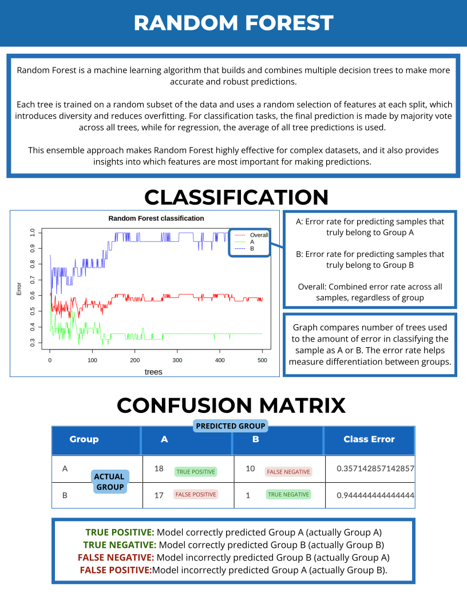

# 

## How to Submit an Analysis

---

## Volcano Plot

---

## Heatmap

---

## Statistical Parametric Test

---

## Fold Change Analysis

---

## Principal Component Analysis (PCA)

---

## Venn Diagram

---

## Normalization

---

## Random Forest

---

## Feature & Outlier

---

## GO & Kegg Analysis

---

## Network Analysis

---

## Results & Download

