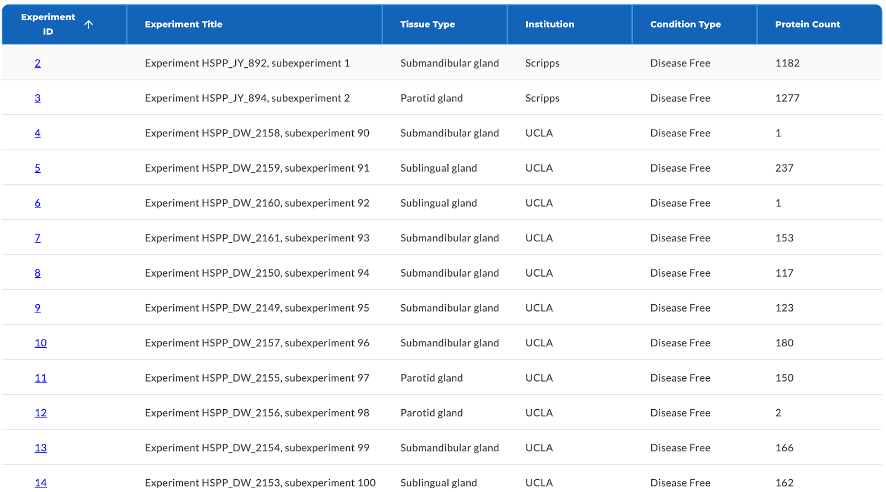
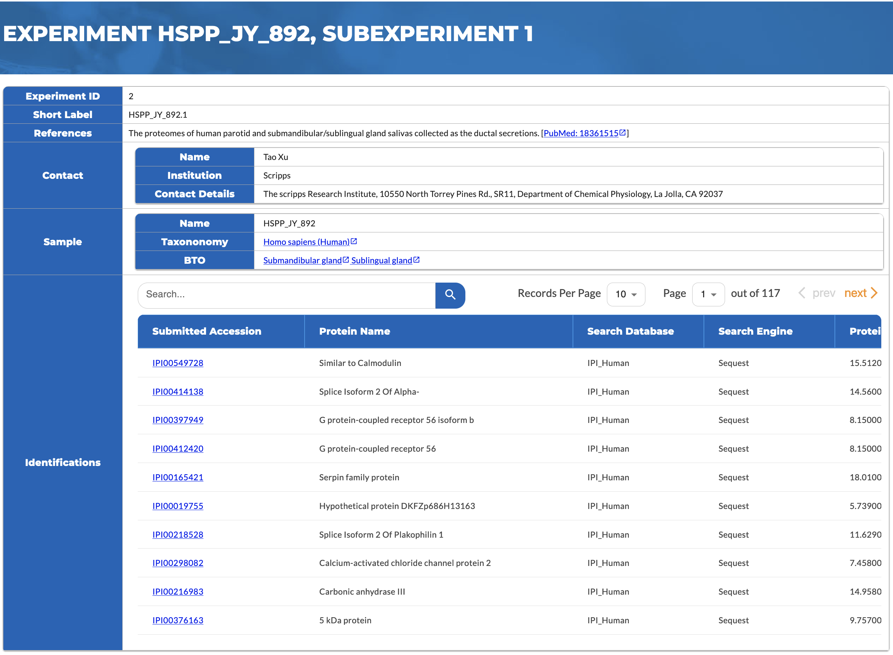
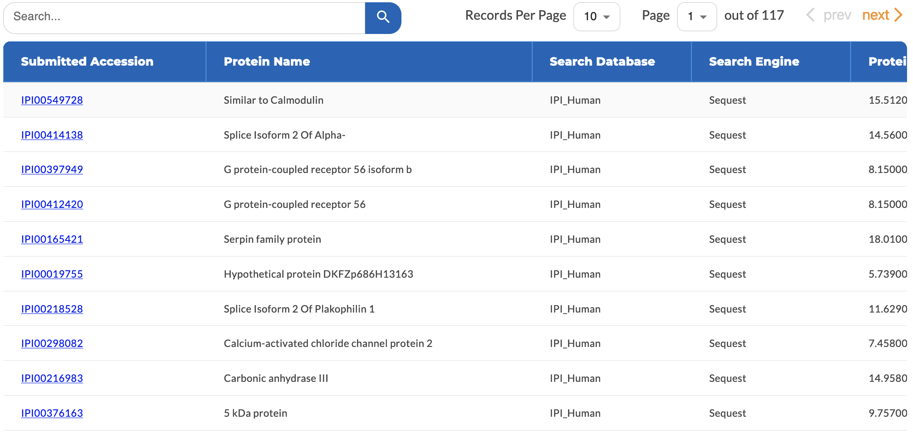

# Proteomics Database

A dedicated database has been incorporated to the Human Salivary Proteome to store all the MS/MS data submitted by the community. This database is known as the PRoteomics IDEntifications database or PRIDE. It is a standards-compliant database with support for various proprietary data formats as well. The database consists or mass spectra, peptide and protein identifications, and protocol metadata. To maximize search performance, a data warehouse optimized for large-scale querying is used to mirror the data stored in PRIDE. For more information about PRIDE and the BioMart data warehouse, please see [https://www.ebi.ac.uk/pride/markdownpage/documentationpage](https://www.ebi.ac.uk/pride/markdownpage/documentationpage)

The HSP has several interfaces to seamlessly interacts with our local instance of PRIDE and BioMart. It provides a single point of submission and can exchange data with other proteomics repositories. In addition, the HSP also leverages the data stored in the proteomics database to automatically determine which proteins can be classified as salivary proteins and measures their abundance through sequence coverage and the number of peptide hits.

# Browsing and Searching

To view the proteomics data associated with a particular protein, click on the Tools tab on the protein page, and select Proteomics Identifications. The list of experiments that have identified the protein will be shown. A search interface is also available for you to query for experiments and identifications using one of the five attributes listed. For example, you can look for proteins using any accession numbers of your choice (e.g. UniProt or IPI) with the "Any mapped protein accession" field.

## Experiment List

The data stored in the database is organized hierarchically in the order of experiments, protein identifications, and peptide identifications. As a result, the initial returns from your search or through the protein pages are experiments that contain items of your interest. **Figure 1** shows the result table which also indicates the number of proteins and peptides that match the query. If your search is not protein or peptide specific, then the counts will show all the identifications from the corresponding experiment. More information about the experiments can be retrieved by clicking the links in the Accession column of the table.

**Figure 1:** The list of experiments returned by searching against the PRIDE database for data submitted by a certain lab.

## Experiment Details

**Figure 2** shows a table containing detailed information about an experiment. It lists contact information of the person who submitted the data, properties of the tissue sample, citations, and other metadata describing the protocol. The "View identification details" link will take you to a list that shows all the proteins identified in this experiment.

 
**Figure 2:** Detailed information about an experiment, including contact and sample data, can be viewed on the experiment detail page.

## Identifications

Protein and peptide identifications are generated by matching MS/MS spectra to a protein database (see **Figure 3**). UniProt has become more and more popular as the number of sequences it indexes continues to improve. The protein and peptide identifications tables list the output from the spectra search. Note that the same attribute may have different meaning or can be calculated differently depending on the search engine used (e.g. [SEQUEST](http://fields.scripps.edu/yates/wp/?page_id=17), [Mascot](http://www.matrixscience.com/), [X! Tandem](https://www.thegpm.org/TANDEM/index.html), etc.). Please refer to the the appropriate documentations when interpreting these data.

 
**Figure 3:** The proteins identified from an experiment showing the search engine used and its output.

## References

**Vizcaíno JA, et al.** (2009) A guide to the Proteomics Identifications Database proteomics data repository. Proteomics 9(18):4276-83 [PubMed:19662629]

**Haider S, et al.** (2009) BioMart Central Portal--unified access to biological data. Nucleic Acids Res. 37(Web Server issue):W23-7 [PubMed:19420058]
