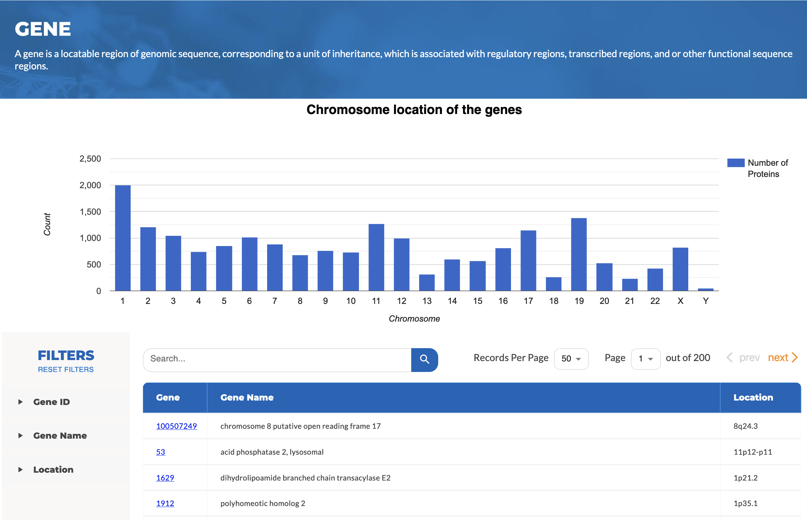
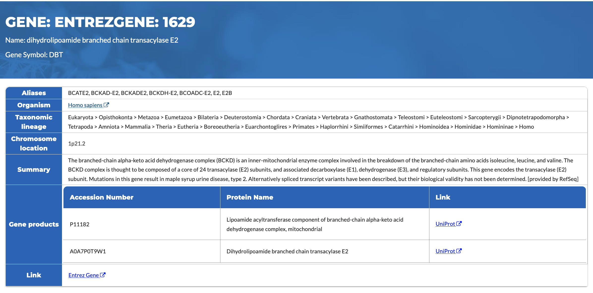

# Genes

A gene is a locatable region of genomic sequence, corresponding to a unit of inheritance, which is associated with regulatory regions, transcribed regions, and or other functional sequence regions. Genes that produce proteins are called protein-encoding genes. In HSP V2.0, we curated human protein-encoding genes and their basic characteristics, as well as links to UniProt and Entrez Gene at NCBI for detailed information about these protein-encoding genes.

 
**Figure 1:** The Gene page shows the number of protein-encoding genes in different chromosomes (top). The UI allows the user to search for the genes using keywords including gene ID, name, and location, which can also be specified in the left panel as filtering criteria for interactive browsing. At the bottom of the table the user can download the list of the genes in CSV format.

In HSP V2.0, we focus on basic information about the protein-encoding genes to simplify the UI and provide complete gene records at the Entrez Gene database at NCBI. In addition, we provide links on UniProt to show complete information about the gene products. Clicking on the gene name (**Figure 1**) will open the gene detail page including gene symbol, alias, organism, taxonomy, chromosome locations etc (**Figure 2**):

- Official symbol and name - At the top of the page is the official symbol and name of the gene.
- Aliases - Any other names that are used to refer to the gene.
- Organism - The origin of this gene.
- Taxonomic lineage - The taxonomic hierarchical classification lineage of the source organism.
- Chromosome location - The gene's address on a chromosome. The location is usually made up of three parts: - The chromosome, the arm of the chromosome, and the band position of the gene on the arm starting from the centromere. For example, the location for mucin 7 (Gene Symbol: MUC7) is 4q13.3, meaning that the gene is located at position 13.3 on the long arm (q) of chromosome 4.
- Summary - A text description about the gene, including its cellular location, its function, and its effect on phenotype.
- Gene products - A list of all the proteins encoded by this gene.

 
**Figure 2.** Basic information about a protein-encoding gene. Its complete record can be found by clicking on the EntrezGene link with information of gene products on UniProt.
