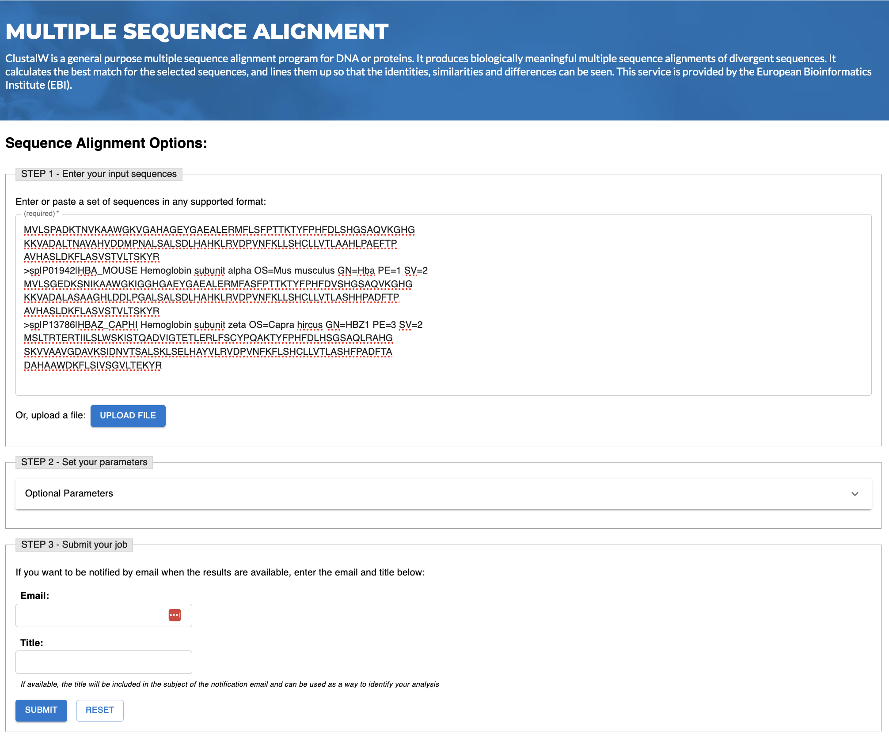
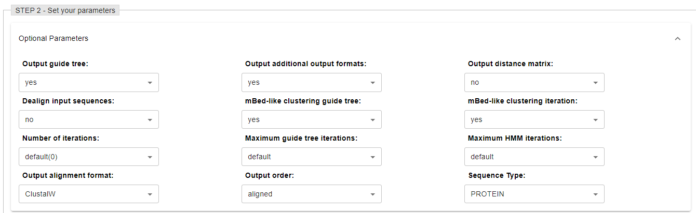
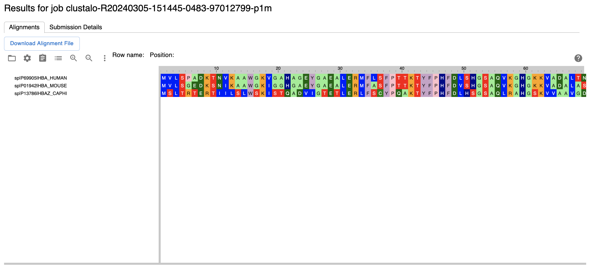
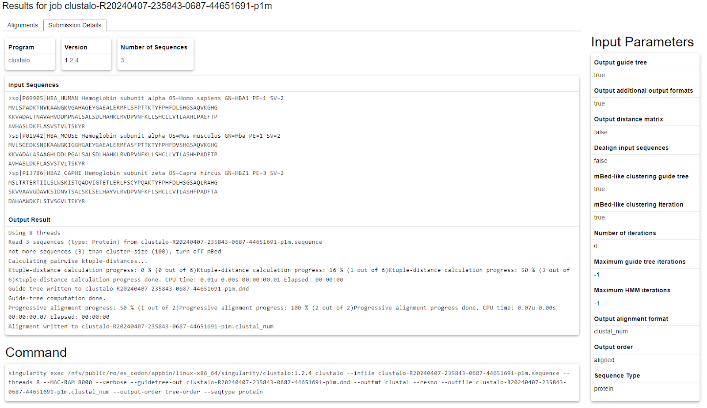

# Clustal Omega (ClustalO)

Multiple sequence alignment detects similarities and differences among DNA or protein sequences to predict the functions and structures of proteins and to identify new members of protein families. Clustal Omega is a new multiple sequence alignment program that uses seeded guide trees and HMM profile-profile techniques to generate alignments between three or more sequences.

## Using the ClustalO Page

 
**Figure 1.** User interface for submitting multiple sequences to analyze sequence similarities and display their alignment and differences using ClusterO in HSP V2.0.

There are 3 steps to use the sequence alignment function in HSP V2.0.

1. The user first needs to paste multiple sequences in the edit box or upload a file containing multiple sequences in STEP 1 (**Figure 1**).
2. The optional output parameters can be specified in STEP 2 (**Figure 2**).
3. Finally the user can submit the alignment job by clicking the SUBMIT button in STEP 3.

The alignment analysis is supported through [EMBL-EBI](https://www.ebi.ac.uk/jdispatcher/msa/clustalo). In some cases the analysis results cannot be returned in real time.The system will notify the user to provide their email and the title of the analysis task in STEP 3 and the window will show the user task in queue (**Figure 3**). Once the job is completed, the user will be notified via email.

 
**Figure 2.** Different types and formats of output parameters are available in HSP V2.0 sequence alignment analysis.

 
**Figure 3.** Window showing a successful job submission in HSP V2.0 before displaying the sequence alignment results.

## Display of Results

The resulting MSA (multiple sequence alignment) is visualized in Jalview for editing, visualization, and analysis using the MSAView plug-in (**Figure 4**). The provenance of the analysis job can be found in the tab of Submission Details for reproducible sequence alignment analysis (**Figure 5**).

 
**Figure 4:** Sequence alignment results of protein cluster members visualized in Jalview using MSAView pluginin.

 
**Figure 5.** Data and analysis provenance for reproducible sequence alignment analysis.

## References

1.  **Madeira F, Pearce M, Tivey ARN, et al.** Search and sequence analysis tools services from EMBL-EBI in 2022. Nucleic Acids Research. 2022 Jul;50(W1):W276-W279. DOI: 10.1093/nar/gkac240. PMID: 35412617; PMCID: PMC9252731.

2.  **Sievers F, Wilm A, Dineen D, Gibson TJ, Karplus K, Li W, Lopez R, McWilliam H, Remmert M, Söding J, Thompson JD, Higgins DG.** Fast, scalable generation of high-quality protein multiple sequence alignments using Clustal Omega. Mol Syst Biol. 2011 Oct 11;7:539. doi: 10.1038/msb.2011.75. PMID: 21988835; PMCID: PMC3261699.
