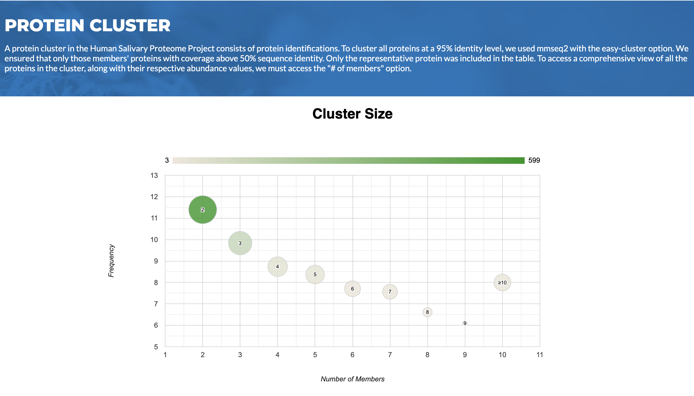
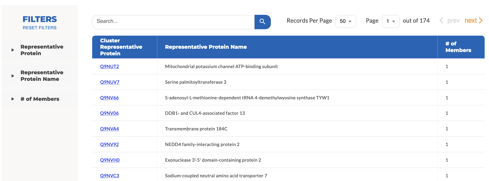

# Protein Clusters

Some proteins may have identical amino acid chains in part of their sequences. Peptide-based evidence cannot distinguish between redundant identifications that likely represent homologs and isoforms. In the Human Salivary Proteome V2.0 (HSP V2.0), proteins are grouped together when they are produced from identical peptide evidence. In addition, protein clusters that share one or more common proteins are merged further. All cluster pages can be accessed from any page using the navigation menu (Browse > Protein clusters).

## Cluster Members

 
**Figure 1:** A frequency plot showing the number and size of protein clusters.

**Figure 1** shows the frequency (log2 transformed, y-axis) of different sizes of protein clusters (size defined as the number of member proteins, x-axis). The size of the circle represents the frequency. The larger a cluster is, the less frequent it is. The largest cluster currently has 36 protein members.

## List of Protein Clusters and Basic Information

 
**Figure 2:** Search, filtering, and browsing interface for protein clusters and their representative proteins.

As shown in **Figure 2**, in addition to the protein accession number and name of the representative protein, each row also displays the size of the cluster. Each column is sortable by clicking on the column header. The search box on the top (**Figure 3**) allows the user to type in a keyword to search for the matching protein clusters and the representative proteins. The left panel provides three options for filtering the table content based on: accession number, protein name, and size (number of members) of the cluster. When both searching and filtering keywords are provided, the results will show the protein clusters that meet both criteria. The table will automatically refresh while the user types in a keyword or a filtering criterion in the left panel. At the bottom of the table there is a button “Download Spreadsheet” for the user to download the list (CSV format) of all the protein clusters shown on the current page.

 
**Figure 3:** Use a keyword to search for protein clusters and their representative proteins.

## Definition and Identification of Representative Proteins in a Cluster

We first used mmseq2 with the easy-cluster option to produce the protein clusters at a 95% identity level. Then a single representative protein is selected from each cluster based on the likelihood that the protein is actually present in the saliva samples. Only those members' proteins with coverage above 50% sequence identity are included.

## Navigation in Protein Clusters

If there is more than one protein member in a cluster, clicking on the representative protein name will show all the member proteins and their names and other characteristics, as shown in **Figure 4**, providing further insights with the possible explanation for why the proteins are grouped together.

**Figure 4:** List of member proteins in the cluster represented by P68371.

Clicking on the protein accession number in **Figure 4** will open the protein details page, as shown in **Figure 5**.

 
**Figure 5:** Detailed information of representative protein in a protein cluster.
