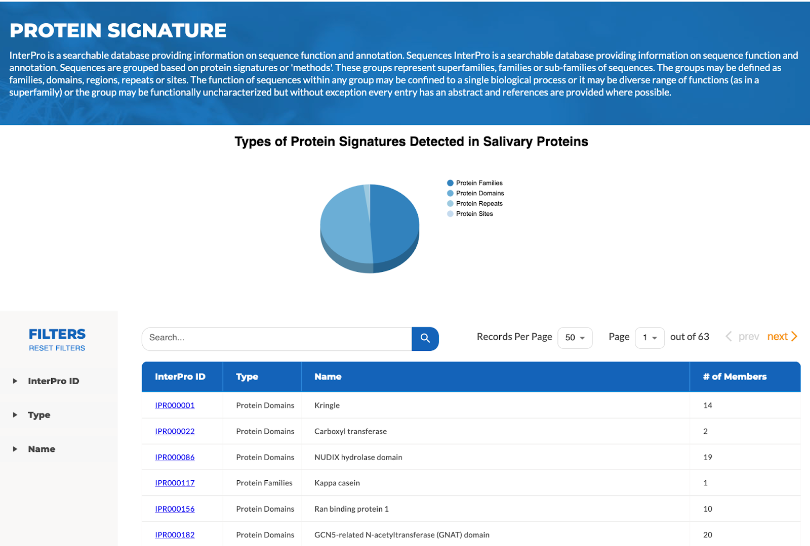
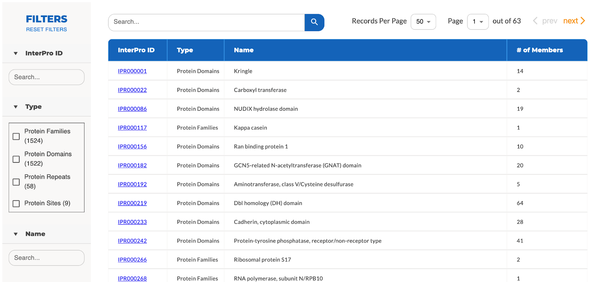
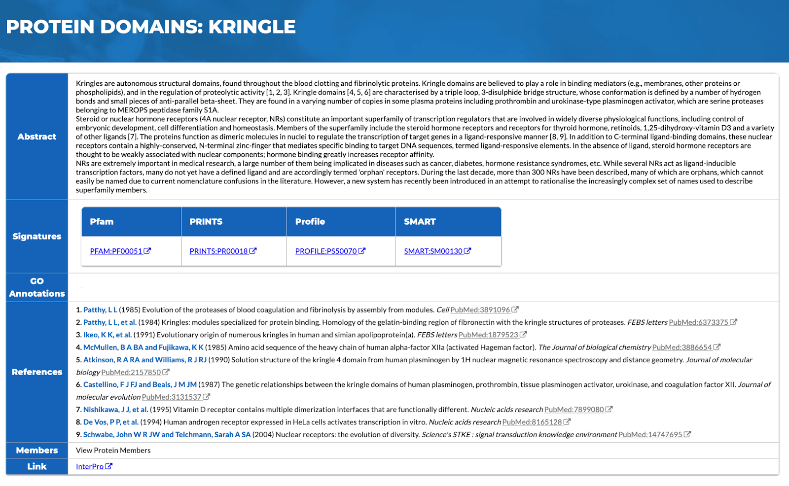

# Protein Signature

Similar to protein clusters, protein sequences can be grouped based on their signatures, which are predictive characteristics representing protein families, domains, regions, repeats, or sites. Protein signatures, e.g., whether certain proteins belonging to the same family or sharing a domain, can be built from multiple sequence alignment to detect divergent homologues that pairwise alignment techniques cannot. In HSP V2.0, the user can search for salivary protein signatures based on InterProID, type or name of the protein, as well as keywords, as **Figure 1** shows.

**Figure 1:** Browse and search protein signatures based on ID, Type, Name, or User-Provided Keywords.

In HSP V2.0, the user can browse and search for signatures of four types of protein groups: protein families, protein domains, protein repeats, and protein sites (**Figure 2**).

**Figure 2:** Type of filters used in protein signature search.

If the user clicks on the InterPro ID of a protein, e.g. IPR000001 for Kringle, the protein details will show (**Figure 3**). Multiple types of information about the protein are summarized on a single page with external links as well as publication references for easy access and reading. External links to signature details on four platforms including Pfam, PRINTS, PROFILE, and SMART are provided when the information is available. The Gene Ontology Terms, if available, are also provided for pathway annotation of the molecular function, biological process, and cellular component of the protein.

**Figure 3:** Protein details page showing protein annotations and information across databases with references.
