# Converting Proteomic Thermo Raw files to mzTab using Proteome Discoverer

Example files to convert can be found here: [https://www.ebi.ac.uk/pride/archive/projects/PXD033661](https://www.ebi.ac.uk/pride/archive/projects/PXD033661)

- Create new study in Proteome Discoverer

  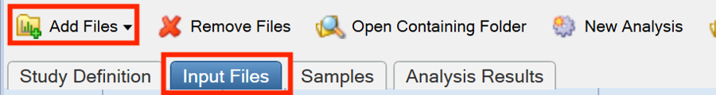

- Select Input Files Tab and click “Add Files” to add files to be converted

  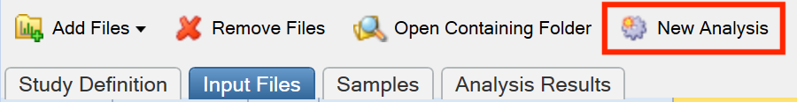

- Click “New Analysis”

  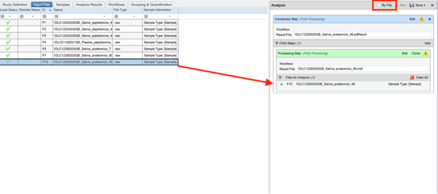

- Drag and drop files you wish to convert to “Files for Analysis” box. You can drag multiple files in. **However, if you would like separate mzTab files for each file, ensure you click “By File”.**

  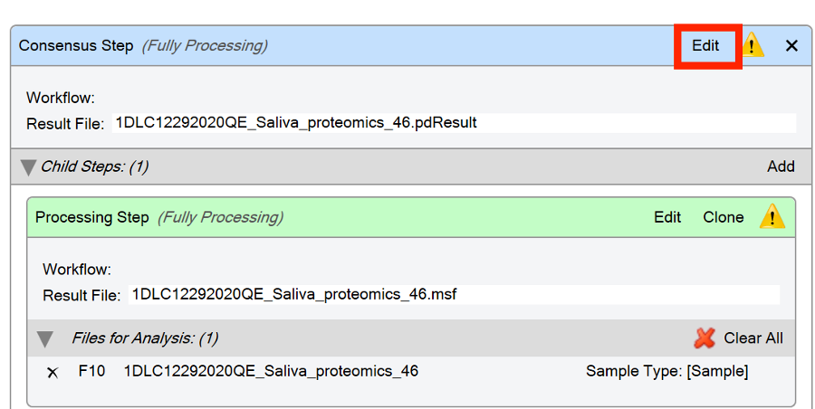

- Click “edit” next to “Consensus Step” heading

  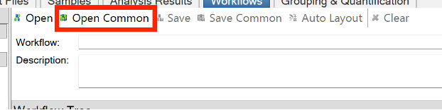
  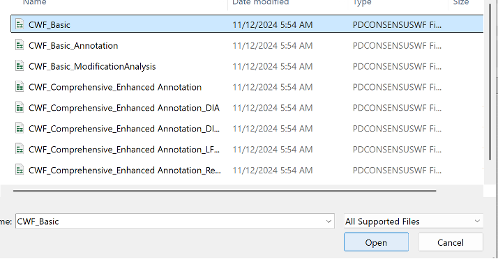

- Click “edit” in “Processing Step” header
  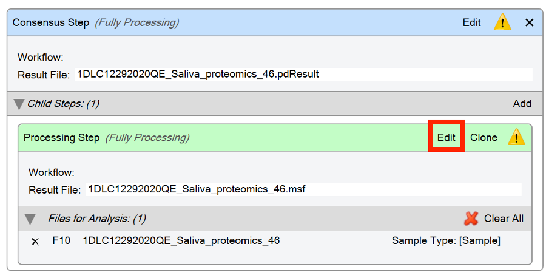

- Click `Open Common`, in the `ProcessingWF_Tribrid` folder, select `PWF_Tribrid_Basic_SequestHT_IT__HCD_CID`

  - `PWF_Tribrid_Basic_SequestHT_OT__HCD_CID` is also okay

    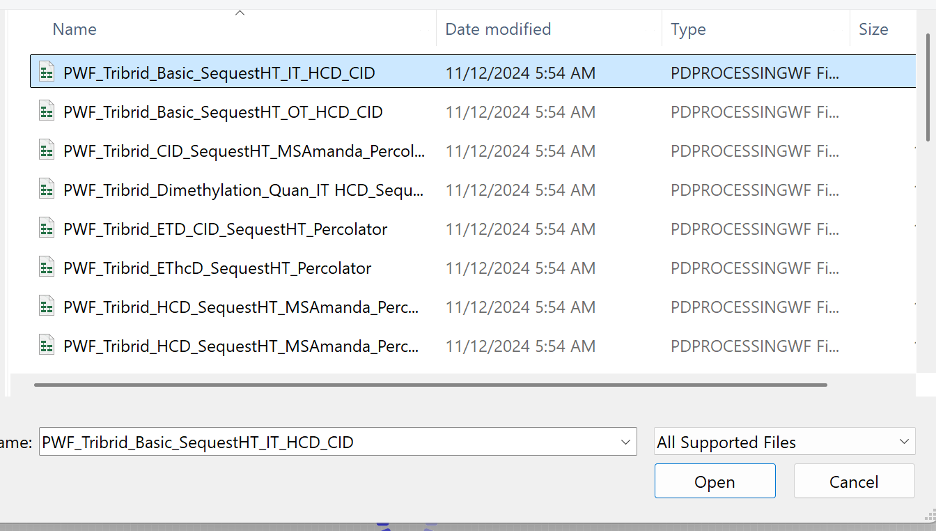

- It is likely you will have to change parameters for two nodes `Spectrum Files` RC and `Sequest HT`. To open parameters, click on the node - the parameters will show up on the left. For the Spectrum Files RC node, you will need to select what Protein Database to use (which will be a `.fasta` file that you will have to upload see tutorial at bottom). Hit the drop down menu next to Protein Database to select which database to use.

  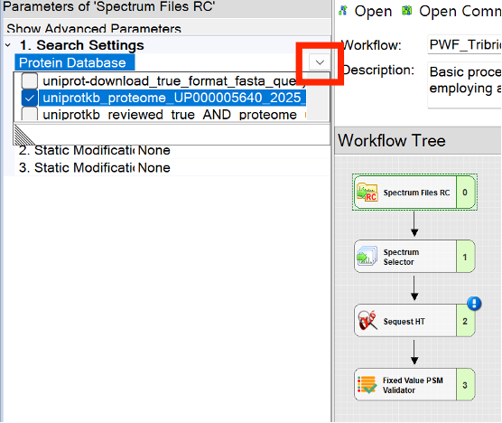

- You must also choose your desired Protein Database for SequestHT. The parameters must also be changed as per the following 2 screenshots. \*If the sample has been treated with an alkylating reagent, remove the carbamidomethylation parameter & replace with none.

  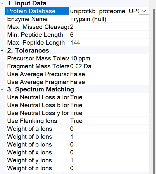

  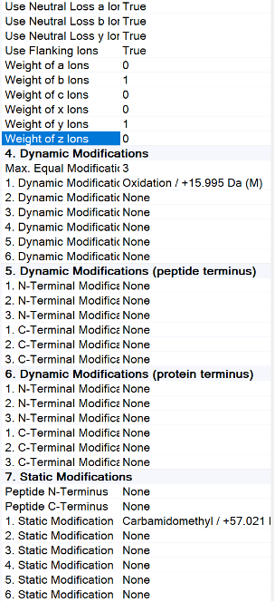

- Now click Run!

  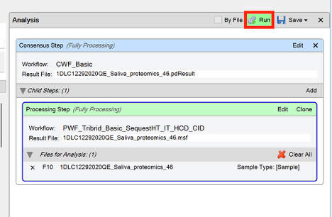

- Once it is finished running, click “Open Results”

  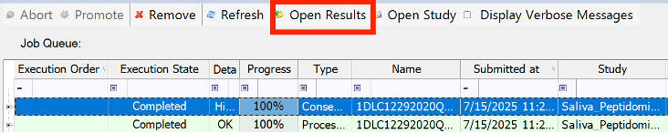

- In the results file, click `file` then `export` then `To mzTab...`

  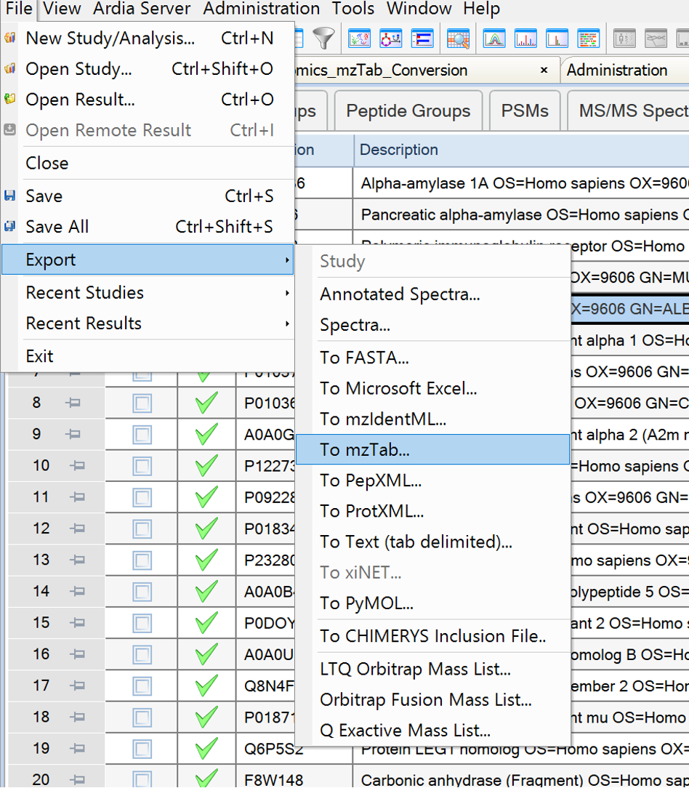

# Converting Peptidomic Thermo Raw Files to mzTab Using Proteome Discoverer

- Create new study in Proteome Discoverer
- Select Input Files Tab and click “Add Files” to add files to be converted

  

- Click “New Analysis”

  

- Drag and drop files you wish to convert to “Files for Analysis” box. You can drag multiple files in. **However, if you would like separate mzTab files for each file, ensure you click “By File”.**

  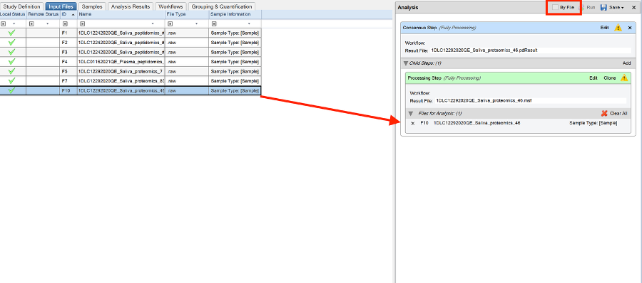

- Click “edit” next to “Consensus Step” heading

  

- Click “Open Common”. In the “ConsensusWF” folder, choose "CWF_Basic” to open

  

  

- Click “edit” in “Processing Step” header

  

- Click “Open Common”, in the `ProcessingWF_Hybrid` folder, select `PWF_Hybrid_MPS_SequestHT_INFERYS_Rescoring_Percolator`

- Delete “Spectrum Files RC” node by right clicking on it and selecting “Cut”. By clicking into the gray space in the workflow tree, a list of possible nodes you can add appears on the left side of the screen. Drag the “Spectrum Files” node into the Workflow Tree. An arrow should automatically appear connecting it to the “Spectrum Selecter” node.

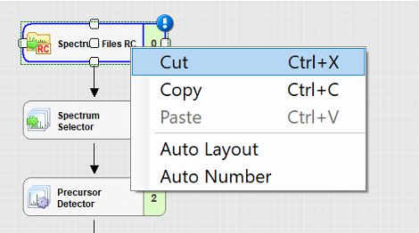

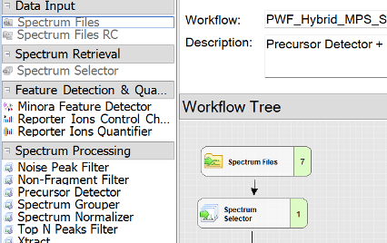

- The parameters for Sequest HT must also be changed as per the following 2 screenshots. You can change these parameters by clicking on the drop down menu beside the desired parameter you want to change. For SequestHT, you will need to provide a Protein Database which you can do via the tutorial at the bottom of this document.

  - If the sample has been treated with an alkylating reagent, remove the carbamidomethylation parameter & replace with none.

  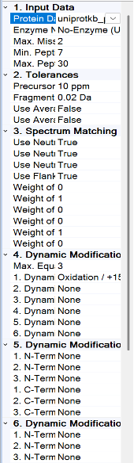 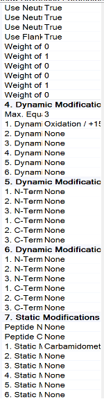

- Now click Run!

  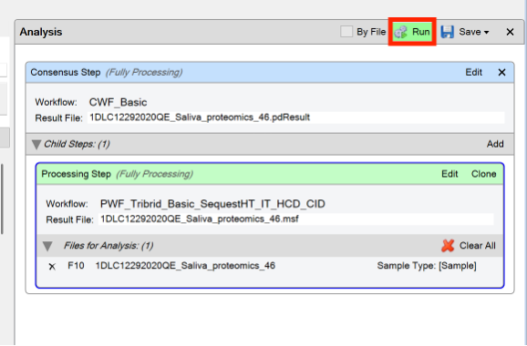

- Once it is finished running, click “Open Results”

  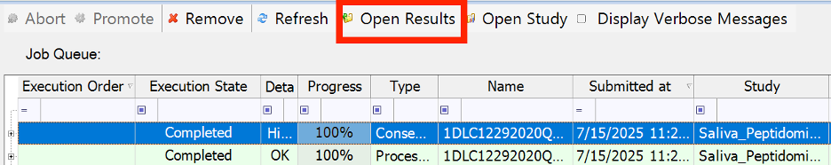

- In the results file, click “file” then “export” then “to mzTab”’

  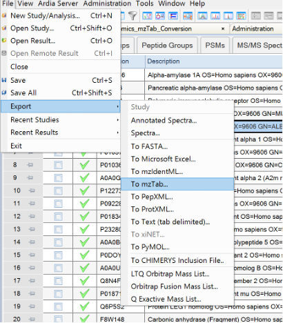

# Uploading .fasta File to Proteome Discoverer

- Navigate to the “Maintain FASTA Files” page in the “Administration” tab.

  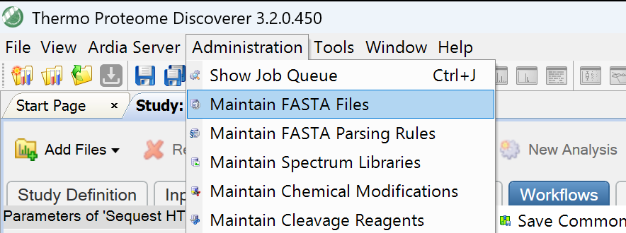

- Click “Add” to add in your desired fasta file. You can also see more information about the fasta files you have already uploaded on this page.

  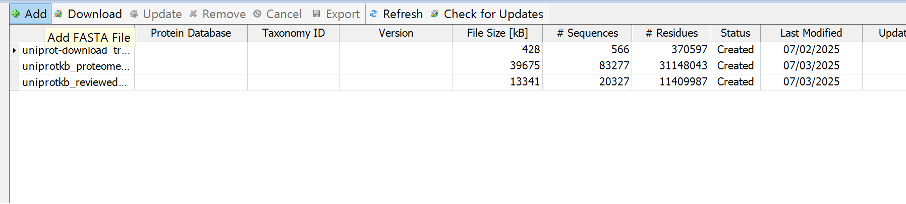
