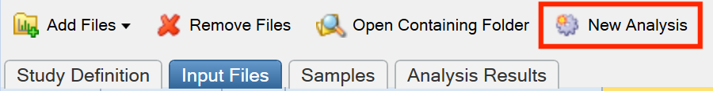
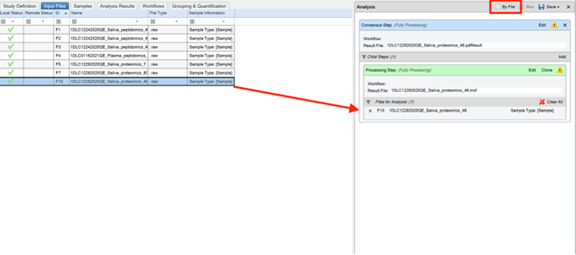
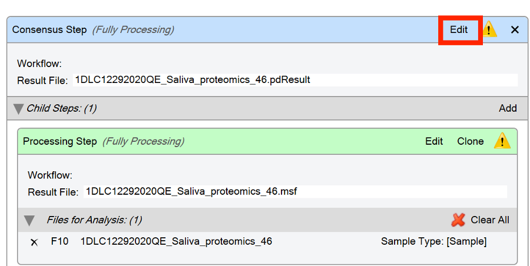
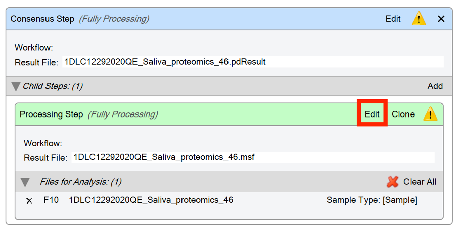
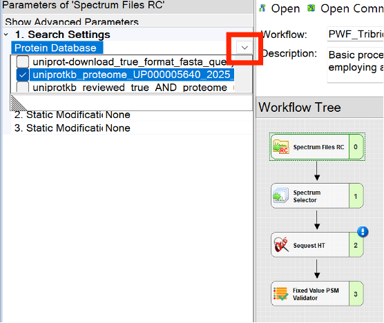
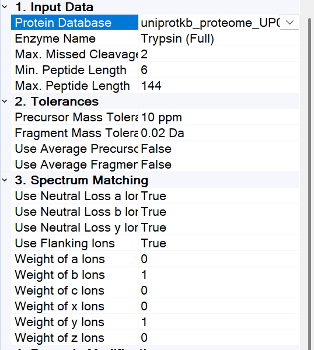
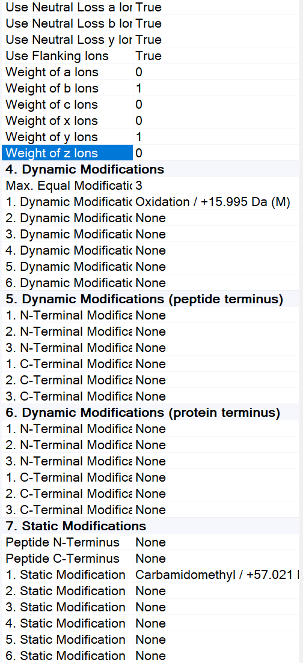
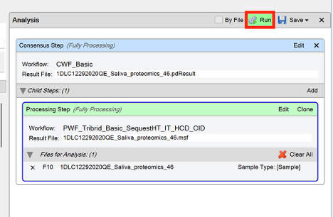
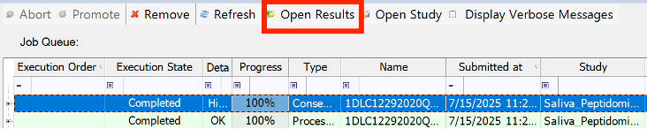
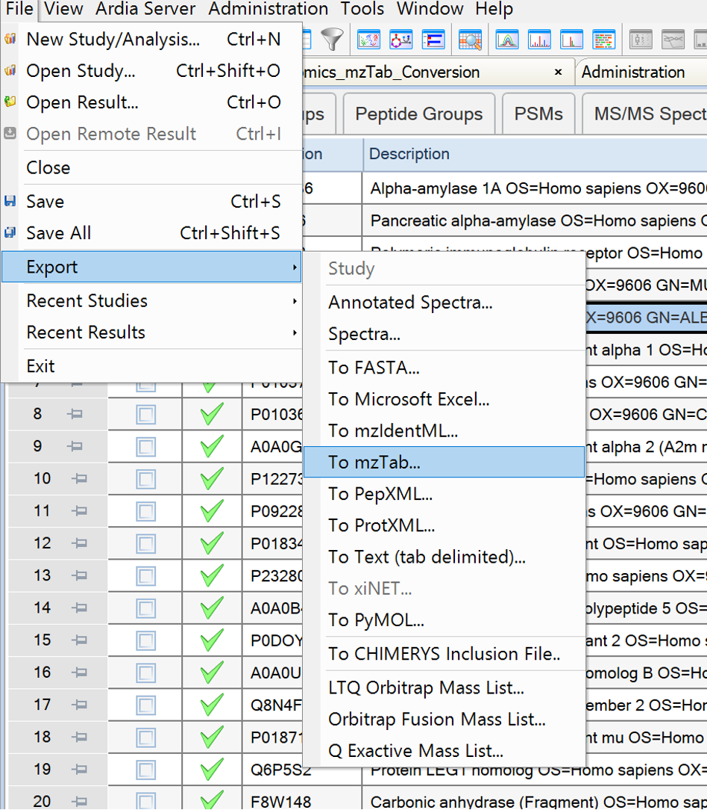

# Converting Proteomic Thermo Raw files to mzTab using Proteome Discoverer

Example files to convert can be found here: [https://www.ebi.ac.uk/pride/archive/projects/PXD033661](https://www.ebi.ac.uk/pride/archive/projects/PXD033661)

- Create new study in Proteome Discoverer

  

- Select Input Files Tab and click “Add Files” to add files to be converted

  

- Click “New Analysis”

  

- Drag and drop files you wish to convert to “Files for Analysis” box. You can drag multiple files in. **However, if you would like separate mzTab files for each file, ensure you click “By File”.**

  

- Click “edit” next to “Consensus Step” heading

  
  

- Click “edit” in “Processing Step” header
  

- Click `Open Common`, in the `ProcessingWF_Tribrid` folder, select `PWF_Tribrid_Basic_SequestHT_IT__HCD_CID`

  - `PWF_Tribrid_Basic_SequestHT_OT__HCD_CID` is also okay

    

- It is likely you will have to change parameters for two nodes `Spectrum Files` RC and `Sequest HT`. To open parameters, click on the node - the parameters will show up on the left. For the Spectrum Files RC node, you will need to select what Protein Database to use (which will be a `.fasta` file that you will have to upload see tutorial at bottom). Hit the drop down menu next to Protein Database to select which database to use.

  

- You must also choose your desired Protein Database for SequestHT. The parameters must also be changed as per the following 2 screenshots. \*If the sample has been treated with an alkylating reagent, remove the carbamidomethylation parameter & replace with none.

  

  

- Now click Run!

  

- Once it is finished running, click “Open Results”

  

- In the results file, click `file` then `export` then `To mzTab...`

  

# Converting Peptidomic Thermo Raw Files to mzTab Using Proteome Discoverer
