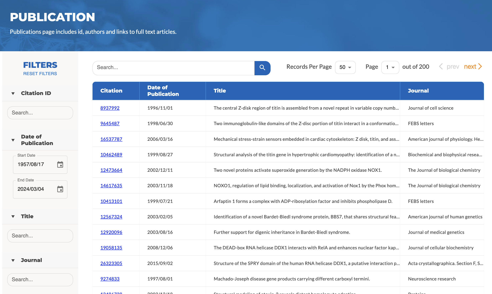
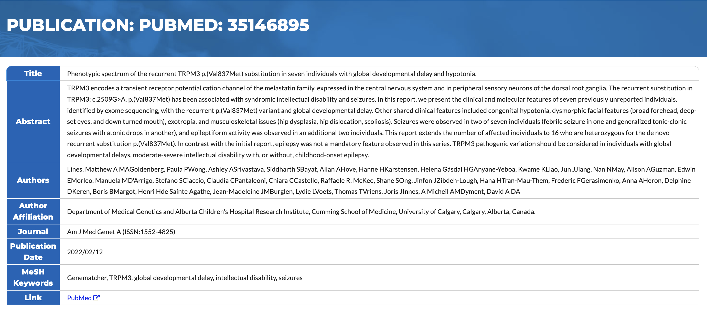

# Publications

<a href="https://pubmed.ncbi.nlm.nih.gov/" target="_blank">PubMed</a> is a service of the U.S. National Library of Medicine that comprises more than 36 million citations of biomedical articles dating back to the 1950s. PubMed citations that are referenced by data in the HSP V2.0 including links to the PubMed articles are archived locally for your viewing convenience. Pages (e.g., salivary proteins page) citing PubMed articles list PMIDs of the articles with the prefix "PubMed:" followed by the accession number.

## Listing of Citations

**Figure 1** shows the PubMed Citations table on the [Publications](https://salivaryproteome.org/citation) page. The table lists citations that are stored in the HSP V2.0 by PubMed ID, Publication Date, Title, and Journal. The citations can be sorted based on these features by clicking on the header of the corresponding column. In addition, the top panel allows the user to search citations based on keywords. The left panel provides a suite of filtering options with “AND” relationship to further limit the search criteria.

 
**Figure 1:** List of up to 10000 PubMed citations stored in HSP V2.0 The articles can be searched using keywords or filtered using IDs, Dates,Titles, and Journals.

## Citation Page Details

When the user clicks on a PubMed ID on pages citing the PubMed article, details of the article will be displayed (**Figure 2**) including:

- **Title** - title of the article
- **Abstract** - if available, an abstract summarizing the article
- **Authors** - each author of the article
- **Author** Affiliation - the main affiliation of the authors; in case of an inter-organization collaboration, this field usually represents the first or corresponding author
- **Journal** - the journal or conference proceeding where the article is published, followed by the unique [ISSN](https://www.issn.org/) identifier of the publication
- **Publication Date** - the date that the article is published
- **MeSH keywords** - a set of topics describing the areas of research or practice this article is about; these keywords are selected by experts from a controlled vocabulary known as the [Medical Subject Headings](https://www.nlm.nih.gov/mesh/meshhome.html).
- **Link** - a link to the citation on the PubMed Website; this link is especially useful if you need to download the full text of the article

 
**Figure 2:** Details of the cited article including abstract, authors, author affiliation, journal, publication date, MeSH keywords, as well as the link to the PuMed entry are shown on HSP V2.0.
