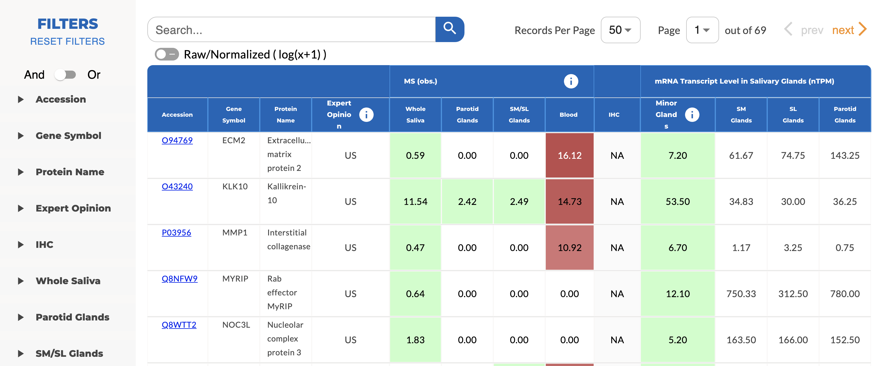
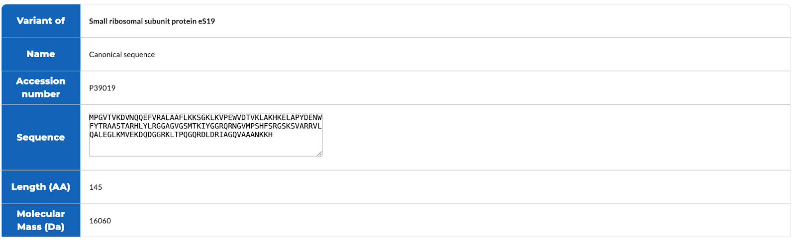

# Salivary Proteins

In March 2008, a team of researchers from across the country mapped a dictionary of proteins present in human saliva. In response, the first version of Human Salivary Proteome (HSP) was developed to provide the public access to this catalog of salivary proteins. The HSP determines which proteins have been identified in saliva using experimental evidence stored in its database and puts them under the Salivary Proteins category, which is a subset of all the human proteins archived in the HSP database.

In [HSP 2.0](https://www.salivaryproteome.org/about) released in February 2024, proteins listed on this page have been manually reviewed and annotated by [UniProt](https://www.uniprot.org/), and have evidence of existence in human saliva through [tandem mass spectrometry (MS/MS)](https://en.wikipedia.org/wiki/Tandem_mass_spectrometry) experiments using whole saliva or glandular secretion samples collected from healthy subjects. The list is updated automatically based on current supporting evidence derived from data uploaded to HSP or retrieved from external sources, such as the [Human Protein Atlas](https://www.proteinatlas.org/). Multiple filtering options based on protein accessions, gene symbols and organisms are implemented in HSP2.0 for interactive exploration of these salivary proteins. A new option for viewing both the Raw or Normalized values of the protein expressions across experiments and organisms is added in HSP2.0.

## Searching for Salivary Proteins of Interest

**Figure 1:** A listing of the salivary proteins for user searching based on different filters

The left panel in **Figure 1** lists the criteria for protein search, which is expanded in **Figure 2**. The user can choose to search based on names and IDs of the proteins (accession, gene symbol, and protein name) as well as the organism types (whole saliva, parotid glands, SM/SL glands, and blood). The expert opinion column provides qualitative assessment on whether the proteins are of salivary origin based on evidence from the literature.

 **Figure 2:** The protein filtering panel.

The filtering panel (**Figure 2**) shows different combinations of abundance and specificity criteria to select for the corresponding subset of salivary proteins to be shown in the main panel (**Figure 1**). The user can choose the tissue or gland type which the MS abundance levels should be extracted. When the filter is active, the indicator "And" or "Or" is to remind users that the criteria are combined or not for the filtering. The user can click the “RESET FILTERS” to clear all the criteria and see the complete list of proteins.

The main panel in **Figure 1** lists the salivary proteins (rows) and their characteristics (columns). The MS (obs.) column uses mass-spectrometry-based evidence and consists of four components that indicate the estimated abundance of the proteins in whole saliva, parotid glands, submandibular (SM)/sublingual (SL) glands secretions, and in blood plasma (Blood). The blood plasma data are derived from canonical proteins in Human Plasma Peptide Atlas builds. In addition, for many of the proteins, their existence in salivary gland tissues have been evaluated via immunohistochemistry (IHC) and RNA-sequencing (under mRNA (NX)) by the Human Protein Atlas. The colors in the heatmap indicate in each column different quantitative levels that go from red to green and lighter shades, representing high to low abundance of the protein in the organism, as well as not observed. The proteins can be sorted based on their abundance in a column by clicking on the column header.

When referring to a protein by its identifier, accession numbers from UniProt are used in HSP v2.0 as the unique ID for the protein. If the user would like to save or view the entire protein list as a spreadsheet, click the "Download Spreadsheet" link on the bottom left corner of the table. Click on "Show Legend" on the bottom right corner of the table to see in detail what the acronyms and labels used in the filters and column headers represent.

The contents on the protein pages are synchronized with the UniProt database periodically. Each protein page is divided into the sections described below. The structure is similar to that in the UniProt database. On top of the page is a set of quick links that you can use to quickly jump to the desired section.

### Names and Origin

As shown in **Figure 3**, this section consists of a list of the different names and synonyms that the protein has, the gene(s) that code for the protein, the source organism, and the taxonomic lineage. If the protein can be cleaved into several functional components, they will also be listed under the Protein names field.

 **Figure 3:** The Names and Origin section of a protein page.

### Sequence Attributes

The table in this section is generated dynamically using semantic queries (**Figure 4**). Each row of the table lists the attributes of a sequence form of the protein, including its source identifier, names, length (in aa), and molecular mass (in Da).

**Figure 4:** The sequence attribute table is created using semantic queries.

You can see the actual sequence by following the link in the Sequence column.

**Figure 5** A sequence page showing parts of the protein sequence.

### Comments and Features

The Comments and Features sections display all the protein annotations from both external and internal sources. Features are position-dependent annotations whereas comments are not. Both types of annotation consist of a number of fields, including the annotation type, description, evidence, literature reference, reported by, etc. The evidence field is populated with codes from the [Evidence and Conclusion Ontology (ECO)](http://www.evidenceontology.org/) . Comment annotations are listed in a table as shown in **Figure 6**. Some of the annotations are described by ontology terms (e.g. GO or KEGG), and have links to the ontology browser for definition and other information about these terms. By default, other than annotations directly imported from UniProt, any users with editor privileges can suggest changes to existing annotations by clicking on the pencil icon under the "Modify" column.

**Figure 6:** Comments are listed in a table under the Comments section.

Feature annotations are displayed in the sequence viewer (**Figure 7**). The annotations are placed into different categories shown on the left side of the viewer. Click on the categories to see individual feature types. On the right side of the viewer are annotations mapped to the regions of protein sequence to which they refer. You can zoom in and out to view specific parts of a sequence using the control on top of the viewer. Click on a particular annotation and a panel will appear showing the attributes associated with the annotation. User annotations are listed in the top track of the viewer and the annotation attribute panel for these annotations has a button for you to suggest modifications (as shown in **Figure 7**).

**Figure 7:** The Features section contains position-specific protein annotations.

### Expression

This section consists of two horizontal bar charts indicating the abundance of a gene product in various tissue sites (**Figure 8**). The bar chart on the left is based on sequencing experiments and shows the mRNA expression levels as the number of transcripts per kilobase million (TPM) reads. The chart on the right shows a qualitative score for each tissue site based on manual inspection of staining intensity and fraction of stained cells from tissue samples stained by immunohistochemistry (IHC). The data from this section are retrieved from the Human Protein Atlas. For more information about the scoring, please go [here](https://www.proteinatlas.org/about/assays+annotation).

**Figure 8:** Abundance of a gene product in various tissue sites measured by RNA-seq (left) and IHC (right).

### Proteomics

The table (**Figure 9**) in this section retrieves peptide identifications associated with the protein and lists them by the tissues and disease states in which they were found. The "Experiment Count" and "Peptide Count" columns indicate how many experiments have found this protein and the number of peptides from these experiments that map to the protein, respectively. The "Abundance Score" is a normalized peptide count that estimates the relative abundance of the protein in the particular tissue and disease state using all the experimental data available.

**Figure 9:** The number of peptide identifications for each tissue type and disease state combination was is retrieved by calculating the abundance of peptides in a protein per experiment (Mztsb files or MZIdentML). We captures the following data: the peptide count (the "count"), protein sequence length (the "length"). Following, we calculated the final abundance: (count / length) / total count over length.

This calculation is also performed for `cleavages_abundance`, and it uses `peptide_cleavages` instead of `protein_sequence_length` for normalization. We used this tool: [https://web.expasy.org/peptide_cutter/](https://web.expasy.org/peptide_cutter/)

### 3D Structures

For proteins with tertiary structures available from the PDB database, this section allows you to view and interact with those structures in [LiteMol](https://webchemdev.ncbr.muni.cz/LiteMol/) simply by clicking on "Open" links in the table shown in **Figure 10**. A quick guide on how to use LiteMol can be found [here](http://www.ebi.ac.uk/pdbe/litemol).

**Figure 10:** A 3D model of the protein rendered by the LiteModel viewer.

### Cross References

This section consists of references to other protein and sequence databases that contain information related to the protein (**Figure 11**). Each reference is hyperlinked to the entry in the corresponding database for you to retrieve additional information.

**Figure 11:** A table listing accession numbers of the protein from other databases.

### Keywords

This is a list of UniProt terms used to summarize the content of the protein entry. You can see the full list of available terms and their definitions from Uniprot.

### References

This section contains PubMed citations that describe the protein (**Figure 12**). These citations are sources for which properties of the protein are extracted. When a new annotation is added, the associated reference, if available, is automatically inserted into the list. Click on the PubMed identifier (PMID) link if you'd like to see the abstract and other details of the citation.

**Figure 12:** Citations that are used to extract information about the protein.

### Entry Information

Majority of the protein records come from the UniProt database. UniProt is composed of 2 sections: Swiss-Prot and TrEMBL. Swiss-Prot contains proteins that are reviewed and manually annotated whereas TrEMBL contains proteins whose sequences are computationally characterized and annotated. Depending on the source database that the protein entry is retrieved from, this section shows the metadata of the entry, including basic info of time and status (Figure. 13).

**Figure 13:** Information about the protein entry.
