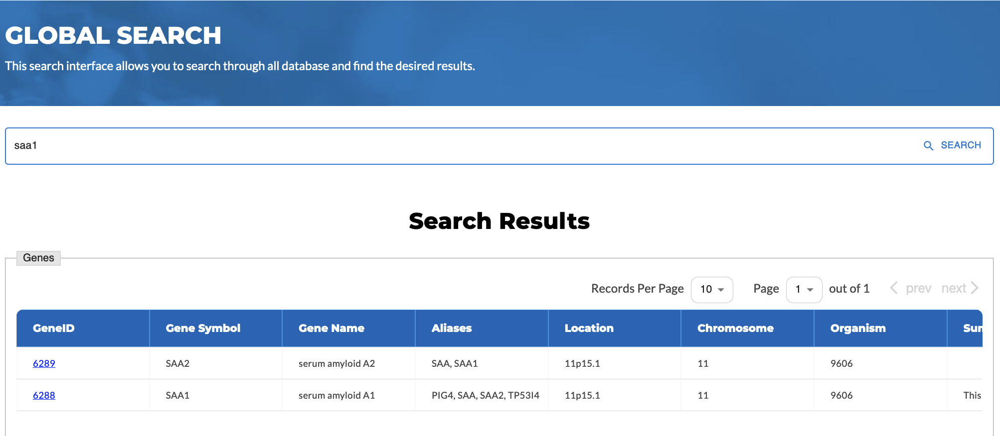
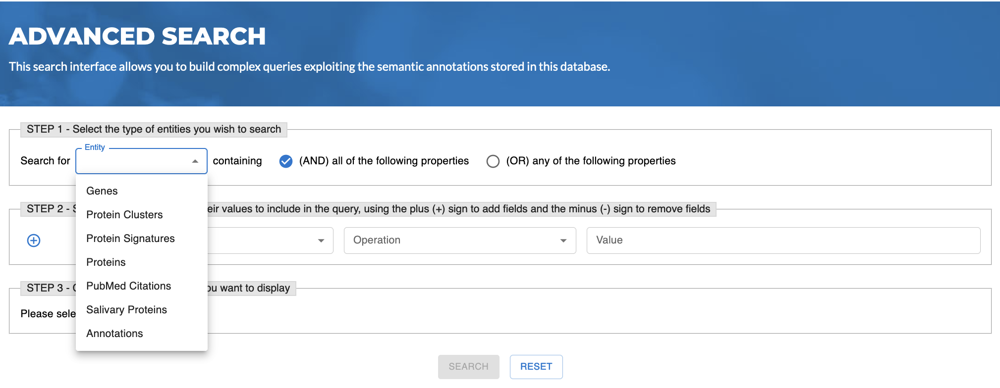
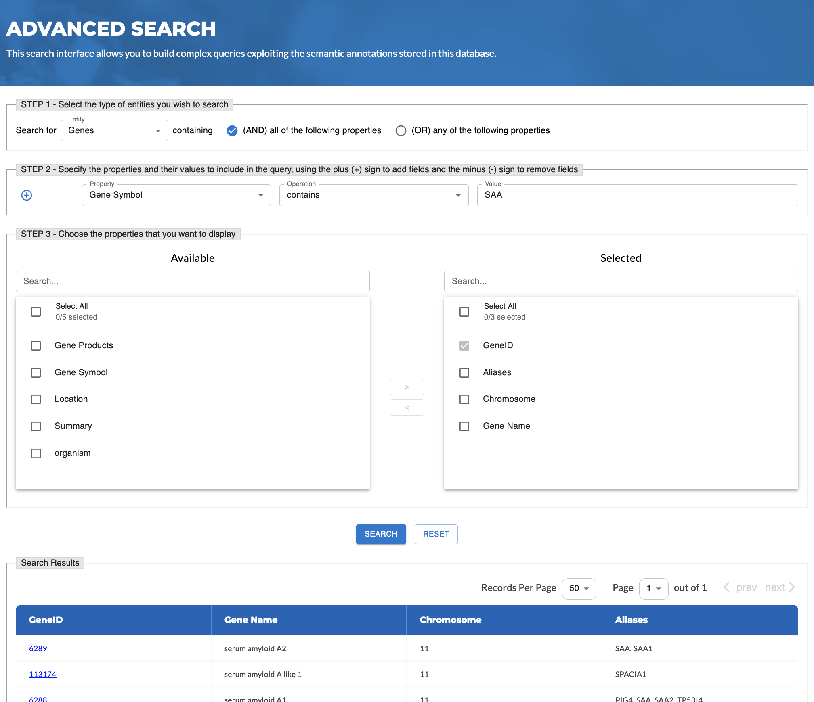
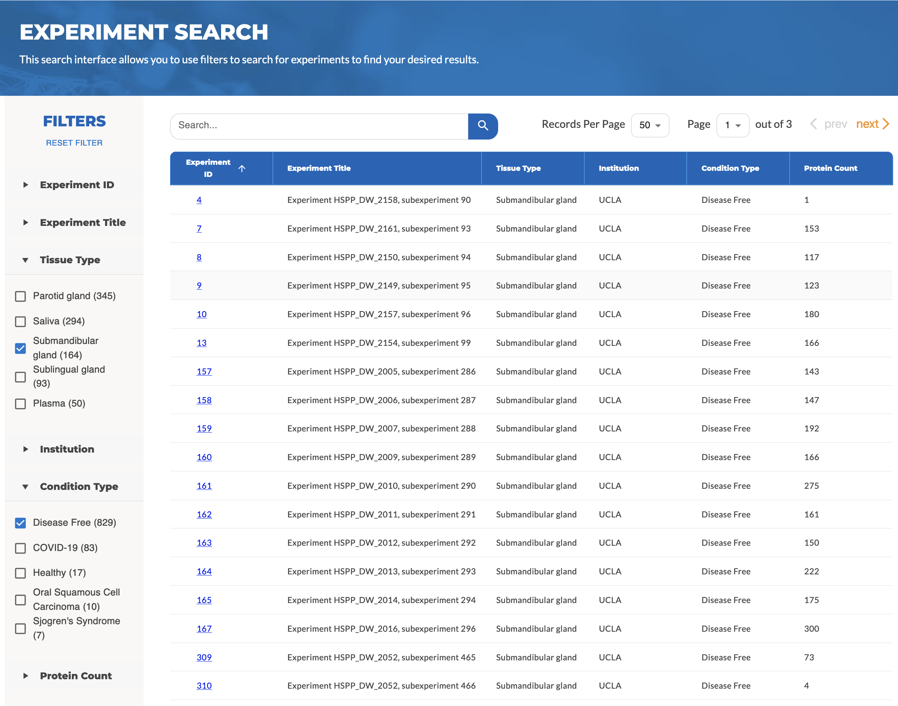
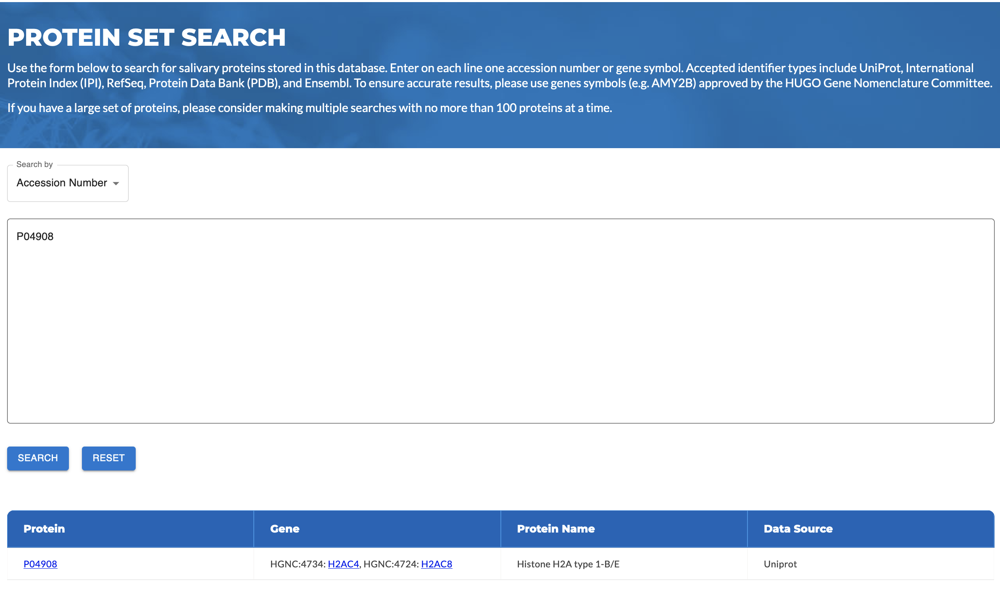

# Searching

Retrieving accurate information for from a large knowledge base is often a daunting task. Fortunately, HSP V2.0 implemented a suite of search functions to make it easy for the user to access and identify the specific information and knowledge of salivary proteins. These search functions allow the user to search in the whole database using arbitrary keywords or standard identifiers as well as combinations of entities and their properties, which provide both flexibility and accuracy for navigating the large knowledge base.

## Global Search Based on Keyword

Unlike document search functions that sometimes return irrelevant pages that need to be read to understand, we implemented the global search function using database queries to guarantee accuracy of the search results. The user may input any keywords including gene names, gene symbols, protein names, or protein accessions of interest. The global search function will scan the whole salivary protein database and return the results in structured tables for easy identification and reuse of the knowledge, as **Figure 1** shows.

**Figure. 1**: Global search returns entities that contain the user-provided keywords.

## Advanced Search for Entities and Their Properties

There are three layers (i.e., steps) in the advanced search process in HSP V2.0. Firstly, the user needs to specify the entity of interest, which includes genes, proteins, salivary proteins, protein clusters, protein signatures, citations, and annotations (**Figure 2**). For each type of entity, there are different properties that the user can select from a drop down list to specify its values for being used as search criteria. For example, when the entity of interest is proteins, the properties for the user to select from the drop down list include protein ID, protein name, experiment ID, abundance, peptide count etc. Finally, the user can customize the display by choosing which properties to be included in the result table.

**Figure. 2**: Three steps for completing the advanced search for identifying entities of interest and their properties

**Figure 2** lists the types of entities in advanced search. An example of searching genes using Gene Symbol is provided in **Figure 3** to show how to customize the result table. Among the 9 properties of a gene entity, the GeneID is by default chosen, while the user can decide whether Gene Name, Gene Products, Gene Symbol, Aliases, Chromosome, Location, Organism, and Summary should be included in the output table or not. The result table is displayed under the criteria so that the user can change them to see the effect intuitively.

**Figure. 3**: Specification of entity properties and customization of the result table in advanced search.

It is important to note that there is a plus (+) button in Step 2 of the advanced search to allow the user to specify combinations of properties and their values for being used in the search criteria. The “AND” or “OR” relationship between these search criteria can be specified in Step 1, as shown in **Figure 3**.

## Experiment Search

When certain salivary proteins and/or protein-encoding genes of interest are identified, it is often necessary to identify the experiments that reported data of these proteins and genes. HSP V2.0 provides a simple and separate but powerful search interface for the user to find the experiments of interest.

**Figure 4:**Identification of experiments of interest by combining ID, title, tissue type and disease conditions

As **Figure 4** shows, the user can search for the experiments of interest by using keywords (top panel) and filters (left panel) by combining properties of the experiments. Facets listed in the left panel are generated based on the experiment content, which are familiar to the scientists. The result table includes the experiment IDs, which can be clicked on to display details of the experiment. The table can be sorted based on content in each column by clicking on the header.

## Protein Set Search

It can be labor intensive to search individual salivary proteins one by one, especially when these proteins of interest are from certain protein sets. HSP V2.0 allows the user to search a set of salivary proteins for their properties using either accession numbers or official gene symbols. The search results including protein ID, gene names and data source are displayed under the protein accessions/symbols for easy review (**Figure 5**). Clicking on the protein ID will open the page of protein details for additional information about the protein.

**Figure. 5**: Search a set of salivary proteins using accession numbers or gene symbols
